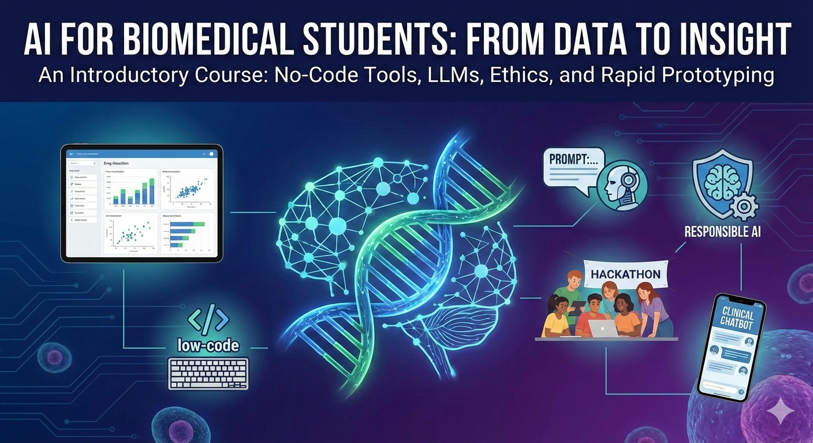

# AI for biomedical scientists

### Course Overview

This course introduces biomedical students to AI.

- Students will learn about AI, no code and low code tools. 
- They will learn how to load data and quickly visualize it and derive results. 
- Basics statistics and mathematical underpinnings.
- They will also learn the basics of using large-language models (LLMs).
- They will also learn prompt engineering
- Responsible AI/AI ethics
- Rapid prototyping/HCI
- Hackathons (such as creating a clinical chatbot)

**Level:** Undergraduate/Postgraduate
**Prerequisites:** Basic programming knowledge (any language)  
**Duration:** 12 weeks (3 hours/week lecture + 2 hours/week lab)  

**Course Instructor:** Soumya Banerjee

**Course Website:** [https://neelsoumya.github.io/AI_for_biomedical_students/](https://neelsoumya.github.io/AI_for_biomedical_students/)

### Course Materials

Course content and materials can be found in the following files:

- [Content](materials/content.md)
- [Setup instructions](materials/setup.md)
- [Python refresher](https://cambiotraining.github.io/ml-unsupervised/materials/python_refresher.html)
- Basics of coding (R)
- NHS data
- [Data visualization](https://neelsoumya.github.io/visualization_lecture/)
- [Data analysis in R and Python](https://cambiotraining.github.io/data-analysis-in-r-and-python/)
- [Mathematical basics of AI and basic statistics](materials/basic_mathematics_stats.md)
- [Basics of unsupervised machine learning using animations and widgets](https://cambiotraining.github.io/ml-unsupervised/materials/walkthrough.html#projection-of-3d-data) and [PCA in your browser](https://projector.tensorflow.org/) and [visual explanations of PCA](https://cambiotraining.github.io/ml-unsupervised/materials/walkthrough.html#visual-explanations-of-pca)
- [Basics of supervised machine learning](https://cambiotraining.github.io/ml-unsupervised/materials/walkthrough.html#example) 
- [Prompt engineering](materials/prompt_engineering.md)
- [No code tools](materials/nocodetools.md)
- [HCI principles and how to prototype](materials/HCI.md)
- AI ethics
- [Student Projects](materials/projects.md)

### Learning Objectives

By the end of this course, students will be able to:
- Create semantic, accessible HTML5 documents
- Design responsive layouts using modern CSS3 techniques
- Develop server-side applications with PHP
- Build secure web applications following best practices
- Deploy and maintain web applications

### Course Structure

#### Module 1: AI Fundamentals (Weeks 1-2)
- Introduction to AI

# AI for Biomedical Scientists
## Learning Objectives and Course Structure

---

## Course Learning Objectives

### Overall Course Goals

By the end of this course, students will be able to:

1. **Understand AI Fundamentals**
   - Explain core concepts of artificial intelligence and machine learning without heavy mathematical formalism
   - Describe different types of AI systems and their applications in biomedical research
   - Differentiate between supervised, unsupervised, and reinforcement learning approaches
   - Understand the capabilities and limitations of modern AI systems

2. **Apply No-Code and Low-Code AI Tools**
   - Select and use appropriate no-code AI tools for biomedical research tasks
   - Perform data analysis and visualization using AI-powered platforms
   - Leverage AI tools for literature review, data interpretation, and hypothesis generation
   - Evaluate the strengths and limitations of different AI tools for specific applications

3. **Work with Large Language Models (LLMs)**
   - Understand the architecture and functioning of large language models at a conceptual level
   - Craft effective prompts to elicit desired outputs from LLMs
   - Apply LLMs to biomedical research tasks including literature synthesis, protocol design, and data interpretation
   - Critically evaluate LLM outputs for accuracy, bias, and appropriateness

4. **Master Prompt Engineering**
   - Design clear, contextual, and constrained prompts for various biomedical tasks
   - Iteratively refine prompts based on output quality
   - Chain prompts together for complex multi-step workflows
   - Recognize and mitigate common prompt engineering pitfalls

5. **Analyze and Visualize Biomedical Data**
   - Load, clean, and prepare biomedical datasets using AI-assisted approaches
   - Create effective visualizations that communicate scientific findings
   - Apply basic statistical methods to interpret data
   - Use AI tools to identify patterns and generate hypotheses from data

6. **Understand Mathematical and Statistical Foundations**
   - Grasp essential mathematical concepts underlying AI algorithms (linear algebra, probability, calculus basics)
   - Apply appropriate statistical tests to biomedical data
   - Interpret statistical outputs and understand measures of uncertainty
   - Recognize when mathematical assumptions may affect AI system behavior

7. **Practice Responsible AI Development and Use**
   - Identify ethical concerns in AI applications to biomedicine and healthcare
   - Recognize and mitigate bias in AI systems and datasets
   - Understand privacy concerns related to biomedical data and AI
   - Apply principles of responsible AI development and deployment
   - Evaluate AI systems for fairness, transparency, and accountability

8. **Apply Human-Computer Interaction (HCI) Principles**
   - Design user-centered AI interfaces for biomedical applications
   - Create rapid prototypes of AI-powered tools
   - Conduct basic usability testing and iterate on designs
   - Understand the principles of effective human-AI collaboration

9. **Develop and Present AI-Powered Biomedical Solutions**
   - Identify real-world biomedical problems suitable for AI solutions
   - Design and prototype AI applications addressing these problems
   - Work effectively in teams on complex AI projects
   - Communicate technical concepts to both technical and non-technical audiences
   - Present completed projects with clear explanations of methods, results, and limitations

### Module-Specific Learning Objectives

#### Module 1: AI Foundations (Weeks 1-2)
- Define artificial intelligence and distinguish it from traditional programming
- Explain the biological inspiration for neural networks
- Describe the AI/ML pipeline from data to deployment
- Identify appropriate use cases for AI in biomedical research

#### Module 2: Tools and Practical Skills (Weeks 3-5)
- Navigate and use at least 3 no-code AI platforms effectively
- Load and manipulate datasets using Python/R with AI assistance
- Create publication-quality visualizations
- Interpret basic statistical outputs from AI tools

#### Module 3: Large Language Models and Prompt Engineering (Weeks 6-7)
- Explain how LLMs are trained and generate text
- Design effective prompts using established frameworks
- Verify LLM outputs against reliable sources
- Apply LLMs to literature review, protocol design, and scientific writing

#### Module 4: Mathematics, Statistics, and Critical Thinking (Week 8)
- Perform basic matrix operations relevant to AI
- Calculate and interpret probability distributions
- Apply appropriate statistical tests to experimental data
- Critically evaluate AI model outputs and recognize potential errors

#### Module 5: Ethics and Responsible AI (Week 9)
- Identify sources of bias in biomedical AI systems
- Evaluate AI systems for fairness across different populations
- Apply privacy-preserving techniques to sensitive biomedical data
- Articulate ethical frameworks for AI in healthcare

#### Module 6: Design and Prototyping (Week 10)
- Apply user-centered design principles to AI tools
- Create low-fidelity prototypes of AI applications
- Conduct and interpret basic usability tests
- Iterate on designs based on user feedback

#### Module 7: Hackathon and Project Development (Weeks 11-12)
- Scope a feasible AI project for biomedical applications
- Collaborate effectively in interdisciplinary teams
- Implement a working prototype using available AI tools
- Present technical work to diverse audiences

---

## Week-by-Week Course Structure

### **Week 1: Introduction to AI and Biomedical Applications**

**Topics:**
- What is AI? Definitions, history, and current landscape
- AI vs. Machine Learning vs. Deep Learning: Terminology clarification
- Biological inspiration: How neurons inspired artificial neural networks
- AI in biomedicine: Success stories and cautionary tales
- The AI pipeline: Data → Model → Deployment

**Learning Objectives:**
- Define AI and distinguish it from related concepts
- Explain the relationship between biological and artificial neural networks
- Identify successful applications of AI in biomedical research
- Describe the basic AI development pipeline

**Lecture Activities:**
- Interactive timeline of AI development
- Case study: AlphaFold and protein structure prediction
- Discussion: Where have you encountered AI in your studies?

**Lab Activities:**
- Environment setup (Python/R, course tools)
- Explore biomedical AI applications (interactive demos)
- First interaction with ChatGPT/Claude for simple biomedical queries
- Set up course accounts (GitHub, necessary AI platforms)

**Assignments:**
- Reading: Review of AI applications in your specific biomedical subfield
- Short reflection: What biomedical problem would you want AI to solve?

**Materials:**
- [Content](materials/content.md)
- [Setup instructions](materials/setup.md)

---

### **Week 2: AI Fundamentals and Types of Learning**

**Topics:**
- Supervised learning: Classification and regression with biomedical examples
- Unsupervised learning: Clustering patient populations, dimensionality reduction
- Reinforcement learning: Drug discovery and treatment optimization
- Training, validation, and testing: Why we split data
- Overfitting and underfitting: The bias-variance tradeoff
- Feature selection and engineering in biomedical contexts

**Learning Objectives:**
- Differentiate between supervised, unsupervised, and reinforcement learning
- Explain why data is split into training/validation/test sets
- Recognize overfitting in model outputs
- Describe how features affect model performance

**Lecture Activities:**
- Interactive demonstration: Training a simple classifier on biomedical data
- Visualization of overfitting and underfitting
- Discussion of feature selection in genomics data

**Lab Activities:**
- Explore pre-built ML models (Google Teachable Machine)
- Hands-on: Train a simple image classifier on cell images
- Experiment with overfitting using different dataset sizes
- Introduction to Python/R for data manipulation

**Assignments:**
- Quiz on AI fundamentals
- Reflection: Identify a supervised vs. unsupervised learning problem in your research area

**Materials:**
- [Content](materials/content.md)
- [Python refresher](https://cambiotraining.github.io/ml-unsupervised/materials/python_refresher.html)

---

### **Week 3: No-Code AI Tools for Research**

**Topics:**
- Overview of no-code AI landscape
- Literature management AI tools: Elicit, Consensus, SciSpace
- Data analysis platforms: Julius AI, DataChat
- Protein structure prediction: AlphaFold Server, ESMFold
- Image analysis tools for microscopy
- When to use no-code vs. low-code vs. custom code

**Learning Objectives:**
- Navigate and effectively use at least 3 no-code AI platforms
- Select appropriate tools for specific biomedical research tasks
- Evaluate the trade-offs between ease of use and customization
- Extract actionable insights from AI tool outputs

**Lecture Activities:**
- Live demonstrations of key tools (Elicit, Julius AI, AlphaFold)
- Comparison matrix: When to use which tool
- Guest speaker (optional): Researcher using AI tools in their work

**Lab Activities:**
- Hands-on with Elicit: Conduct a mini literature review
- Use Julius AI to analyze a provided biomedical dataset
- Predict protein structure using AlphaFold Server
- Tool exploration: Students try different tools and share findings

**Assignments:**
- Tool review: Test 3 tools, write comparative analysis
- Use no-code tool to solve a provided biomedical problem

**Materials:**
- [No code tools](materials/nocodetools.md)

---

### **Week 4: Data Loading, Cleaning, and Manipulation**

**Topics:**
- Data types in biomedical research (tabular, images, sequences, time-series)
- Loading data from various formats (CSV, Excel, FASTA, DICOM)
- Data cleaning: Missing values, outliers, normalization
- Data transformation and feature engineering
- Using AI to assist with data preprocessing
- Pandas/R data frames for biomedical data
- Handling large datasets efficiently

**Learning Objectives:**
- Load biomedical data from multiple file formats
- Identify and handle missing data, outliers, and errors
- Transform data into formats suitable for analysis
- Use AI assistants (ChatGPT/Claude) to generate data processing code
- Apply appropriate normalization techniques

**Lecture Activities:**
- Common data quality issues in biomedical research
- Demonstration: Cleaning a messy genomics dataset
- Best practices for data documentation and reproducibility

**Lab Activities:**
- Load and explore multiple biomedical datasets (gene expression, clinical data, imaging metadata)
- Clean datasets with missing values and outliers
- Use ChatGPT/Claude to generate data cleaning scripts
- Transform data for downstream analysis
- Practice session: Students bring their own data issues

**Assignments:**
- Data cleaning challenge: Clean provided messy dataset
- Document your data processing pipeline for reproducibility

**Materials:**
- [Data analysis in R and Python](https://cambiotraining.github.io/data-analysis-in-r-and-python/)
- [Python refresher](https://cambiotraining.github.io/ml-unsupervised/materials/python_refresher.html)

---

### **Week 5: Data Visualization and Exploratory Analysis**

**Topics:**
- Principles of effective data visualization
- Choosing appropriate plot types for different data
- Visualization libraries: matplotlib, seaborn, ggplot2
- Interactive visualizations for exploration
- Publication-quality figures
- Common visualization mistakes and how to avoid them
- Using AI to generate visualization code
- Exploratory data analysis (EDA) workflows

**Learning Objectives:**
- Create clear, accurate visualizations of biomedical data
- Select appropriate plot types for specific data and messages
- Generate publication-quality figures
- Use AI tools to create and refine visualizations
- Conduct thorough exploratory data analysis

**Lecture Activities:**
- Gallery of good vs. bad biomedical visualizations
- Principles of visual perception and cognition
- Live coding: Creating effective plots
- Discussion: What makes a figure "publication-quality"?

**Lab Activities:**
- Create multiple visualizations of the same dataset
- Use Julius AI and ChatGPT to generate visualization code
- Critique and improve provided figures
- EDA challenge: Discover insights in unfamiliar dataset
- Create a multi-panel figure for a mock publication

**Assignments:**
- Visualization portfolio: Create 5 different plot types from provided data
- Peer review: Critique classmates' visualizations
- Create publication-ready figure with caption

**Materials:**
- [Data visualization](https://neelsoumya.github.io/visualization_lecture/)
- [Data analysis in R and Python](https://cambiotraining.github.io/data-analysis-in-r-and-python/)

---

### **Week 6: Large Language Models - Understanding and Applications**

**Topics:**
- What are LLMs? Architecture at a conceptual level
- How LLMs are trained: Pre-training and fine-tuning
- Tokens, context windows, and temperature
- Capabilities: Text generation, summarization, translation, code generation
- Limitations: Hallucinations, knowledge cutoffs, reasoning failures
- LLMs in biomedical research: Literature review, hypothesis generation, protocol writing
- Multimodal models: Vision capabilities for analyzing figures and images
- Comparison of major LLMs (GPT-4, Claude, Gemini, etc.)

**Learning Objectives:**
- Explain how LLMs generate text at a conceptual level
- Describe the training process for LLMs
- Identify appropriate use cases for LLMs in biomedical research
- Recognize and mitigate common LLM failures
- Use LLMs effectively for research tasks

**Lecture Activities:**
- Interactive demo: How changing temperature affects outputs
- Case studies: Successful and failed LLM applications in biomedicine
- Live demonstration of multimodal capabilities (image analysis)
- Discussion: What can/can't LLMs do?

**Lab Activities:**
- Compare outputs from different LLMs on the same biomedical query
- Experiment with parameters (temperature, length, etc.)
- Use vision capabilities to analyze scientific figures
- Fact-checking exercise: Verify LLM claims about biomedical topics
- Upload and analyze a scientific paper using LLMs

**Assignments:**
- LLM comparison report: Same task, multiple models
- Identify and document 3 LLM hallucinations with verification
- Use LLM to summarize and critique a paper from your field

**Materials:**
- [Content](materials/content.md)
- [Prompt engineering](materials/prompt_engineering.md)

---

### **Week 7: Prompt Engineering for Biomedical Research**

**Topics:**
- The art and science of prompt engineering
- Prompt patterns: Few-shot learning, chain-of-thought, role-playing
- The 4 C's framework: Clear, Contextual, Constrained, Checked
- Iterative prompt refinement
- Prompt chaining for complex workflows
- Domain-specific prompting for biomedicine
- Best practices for reproducible prompting
- Advanced techniques: System prompts, formatting, constraints
- Common pitfalls and how to avoid them

**Learning Objectives:**
- Design effective prompts using established frameworks
- Iteratively refine prompts based on output quality
- Chain prompts for multi-step biomedical workflows
- Apply domain-specific knowledge to improve prompts
- Verify and validate LLM outputs

**Lecture Activities:**
- Live prompt engineering session with real-time refinement
- Analysis of good vs. poor prompts for biomedical tasks
- Building a prompt library for common research tasks
- Discussion: Sharing successful prompts from students

**Lab Activities:**
- Prompt engineering challenges with increasing difficulty:
  - Literature synthesis
  - Protocol design
  - Data interpretation
  - Hypothesis generation
  - Statistical analysis explanation
- Build a personal prompt template library
- Peer review: Test each other's prompts
- Advanced exercise: Create a multi-step research workflow using chained prompts

**Assignments:**
- Create 10 high-quality prompts for your research domain
- Document a complete research workflow using chained prompts
- Reflective essay: How will prompt engineering change your research?

**Materials:**
- [Prompt engineering](materials/prompt_engineering.md)
- Anthropic's prompt engineering documentation

---

### **Week 8: Mathematical and Statistical Foundations**

**Topics:**
- Essential linear algebra: Vectors, matrices, operations
- Probability fundamentals: Distributions, conditional probability, Bayes' theorem
- Statistics for biomedical research: Hypothesis testing, p-values, confidence intervals
- Descriptive vs. inferential statistics
- Common statistical tests: t-tests, ANOVA, chi-square, correlation
- Multiple testing correction (Bonferroni, FDR)
- Basics of calculus: Gradients and optimization (conceptual)
- Understanding AI model outputs: Probabilities, confidence scores, uncertainty
- Statistical software and AI assistance

**Learning Objectives:**
- Perform basic matrix operations relevant to understanding AI
- Calculate and interpret probabilities in biomedical contexts
- Select and apply appropriate statistical tests
- Interpret statistical outputs including p-values and confidence intervals
- Understand how statistics underpin AI model training and evaluation
- Use AI tools to assist with statistical analysis

**Lecture Activities:**
- Visual explanations of linear algebra concepts in AI
- Probability in action: Diagnostic testing and Bayes' theorem
- Common statistical mistakes in biomedical research
- How neural networks learn: Gradient descent visualization
- When to trust AI statistical outputs

**Lab Activities:**
- Matrix operations in Python/R (with AI assistance)
- Statistical analysis of real biomedical datasets:
  - Comparing treatment groups (t-test)
  - Multiple group comparisons (ANOVA)
  - Correlation analysis
  - Survival analysis basics
- Use AI to explain and perform statistical tests
- Interpret outputs from common ML models (confusion matrices, ROC curves)
- Power analysis and sample size calculations with AI help

**Assignments:**
- Problem set: Basic probability and statistics
- Analyze provided dataset using appropriate statistical tests
- Explain a statistical concept to a non-technical audience

**Materials:**
- [Mathematical basics of AI and basic statistics](materials/basic_mathematics_stats.md)
- Khan Academy probability and statistics modules

---

### **Week 9: AI Ethics and Responsible Development**

**Topics:**
- Ethical frameworks for AI in healthcare and research
- Bias in AI systems: Sources, detection, and mitigation
- Fairness: Different definitions and trade-offs
- Privacy and data protection: GDPR, HIPAA, anonymization
- Transparency and explainability in AI
- Accountability: Who is responsible when AI fails?
- Informed consent for AI-driven research and clinical tools
- Equity: Ensuring AI benefits are broadly distributed
- Environmental impact of AI systems
- Case studies: AI ethics failures and successes in biomedicine

**Learning Objectives:**
- Identify ethical issues in AI applications to biomedicine
- Recognize and assess bias in AI systems and datasets
- Apply privacy-preserving techniques to biomedical data
- Evaluate AI systems for fairness across populations
- Make ethically informed decisions about AI development and deployment
- Articulate ethical considerations in AI project proposals

**Lecture Activities:**
- Case study: Racial bias in clinical algorithms
- Case study: Privacy violations in genetic databases
- Discussion: Self-driving cars vs. autonomous medical decisions
- Guest speaker (optional): Bioethicist or healthcare AI expert
- Debate: Should AI be used to predict disease risk from genetics?

**Lab Activities:**
- Audit an AI system for potential bias
- Analyze a biomedical dataset for representation issues
- Privacy exercise: Attempt to de-anonymize datasets
- Fairness metrics: Calculate and compare different definitions
- Design ethical review checklist for AI projects
- Group discussion: Ethical dilemmas in your projects

**Assignments:**
- Ethical analysis of a biomedical AI system
- Write an informed consent form for an AI-driven study
- Develop an ethical framework for your final project

**Materials:**
- [Content](materials/content.md) (ethics section)
- WHO guidelines on AI ethics
- Case studies from biomedical AI ethics literature

---

### **Week 10: Human-Computer Interaction and Rapid Prototyping**

**Topics:**
- HCI principles: Usability, accessibility, user-centered design
- Understanding users: Personas, user stories, task analysis
- Designing for human-AI collaboration
- Interface design for AI tools: Transparency, control, feedback
- Rapid prototyping techniques: Wireframes, mockups, low-fidelity prototypes
- No-code prototyping tools: Figma, Adobe XD, Streamlit
- Usability testing: Methods and interpretation
- Iteration based on user feedback
- Designing for diverse users in healthcare contexts

**Learning Objectives:**
- Apply user-centered design principles to AI tools
- Create user personas and scenarios for biomedical AI applications
- Build low-fidelity prototypes quickly
- Conduct basic usability testing
- Iterate on designs based on feedback
- Design interfaces that promote effective human-AI collaboration

**Lecture Activities:**
- Examples of good and bad AI interface design
- Live demo: Rapid prototyping workflow
- Principles of accessible design in healthcare
- Discussion: What makes an AI tool "usable" for clinicians vs. researchers?

**Lab Activities:**
- Create user personas for a biomedical AI tool
- Design paper prototypes of AI interfaces
- Use Figma or similar tool to create digital wireframes
- Conduct mini usability tests with classmates
- Build a simple AI-powered web app using Streamlit
- Iterate on designs based on feedback

**Assignments:**
- Design a user interface for an AI tool in your domain
- Conduct usability test with 3 users, document findings
- Create iteration plan based on test results

**Materials:**
- [HCI principles and how to prototype](materials/HCI.md)
- Don Norman's "Design of Everyday Things" excerpts

---

### **Week 11: Hackathon Part 1 - Clinical/Research Chatbot Development**

**Topics:**
- Project scoping: Defining feasible AI projects
- Team collaboration and project management
- Building chatbots: Architecture and design
- Integration with biomedical knowledge bases
- RAG (Retrieval-Augmented Generation) for accuracy
- Safety considerations in healthcare chatbots
- Testing and validation
- Documentation best practices

**Learning Objectives:**
- Scope a feasible AI project for the time and resources available
- Work effectively in interdisciplinary teams
- Design and implement a working chatbot prototype
- Integrate reliable biomedical knowledge sources
- Test chatbot outputs for accuracy and safety
- Document project development process

**Format:**
- Team formation (3-4 students per team)
- Project pitches and selection
- Intensive workshop format with instructor support
- Stand-ups and progress check-ins

**Hackathon Activities:**
- **Day 1 (Lab):**
  - Team formation and project selection
  - Scope definition and planning
  - User research and requirements gathering
  - Design chatbot conversation flows
  - Begin implementation
  
- **Day 2 (Additional lab time or asynchronous):**
  - Continue development
  - Integrate knowledge sources (literature, guidelines)
  - Implement RAG or knowledge base retrieval
  - Begin testing with sample queries
  
- **Outside lab:**
  - Refine chatbot responses
  - Conduct internal testing
  - Prepare documentation

**Example Project:**
"Clinical Decision Support Chatbot for Diabetes Management"
- Users: Primary care physicians
- Function: Answers questions about diabetes treatment guidelines
- Data: Integrates current clinical practice guidelines
- Safety: Includes disclaimers, cites sources, flags uncertainty

**Deliverables (Week 11):**
- Working prototype (even if limited functionality)
- Progress documentation
- Initial user testing results

**Materials:**
- [Student Projects](materials/projects.md)
- Project templates and starter code
- Example chatbots for reference

---

### **Week 12: Hackathon Part 2 - Refinement and Presentations**

**Topics:**
- Iteration based on testing
- Communicating technical work to non-technical audiences
- Effective scientific presentations
- Demo-driven storytelling
- Limitations and future work
- Project documentation and reproducibility

**Learning Objectives:**
- Refine AI projects based on feedback and testing
- Create compelling presentations of technical work
- Demonstrate working prototypes effectively
- Critically evaluate own work and identify limitations
- Communicate both successes and challenges honestly
- Plan future development directions

**Format:**
- Continued team work with instructor support
- Presentation skills workshop
- Final presentations and demos
- Peer feedback and evaluation

**Week 12 Activities:**
- **Day 1 (Lab):**
  - Final refinements to projects
  - Usability testing with users from target audience
  - Bug fixes and improvements
  - Prepare presentation materials
  - Practice demos
  
- **Day 2 (Presentations):**
  - Team presentations (10 minutes each + 5 min Q&A)
  - Live demos of working prototypes
  - Peer evaluation and feedback
  - Instructor evaluation
  - Course reflection and wrap-up

**Presentation Structure:**
- Problem statement and motivation (2 min)
- Approach and methods (2 min)
- Demo of working prototype (3 min)
- Results and evaluation (2 min)
- Limitations and future work (1 min)
- Q&A (5 min)

**Final Deliverables:**
- Working prototype (code repository)
- Final presentation
- Project documentation including:
  - Problem statement
  - Methods and approach
  - User testing results
  - Limitations and ethical considerations
  - Future work
  - Code documentation
- Individual reflection (1-2 pages)

**Course Wrap-Up:**
- Review of learning objectives
- Discussion: How will you use AI in your future research?
- Course feedback and evaluation
- Celebration of achievements!

**Materials:**
- [Student Projects](materials/projects.md)
- Presentation templates
- Evaluation rubrics

---

## Assessment Structure

### Grading Breakdown

| Component | Weight | Description |
|-----------|--------|-------------|
| **Weekly Assignments** | 25% | Problem sets, tool reviews, reflections (Weeks 1-10) |
| **Quizzes** | 15% | Short quizzes on key concepts (Weeks 2, 4, 6, 8) |
| **Lab Participation** | 15% | Active engagement in lab activities, peer collaboration |
| **Midterm Project** | 15% | Individual project using AI tools (Week 7) |
| **Final Hackathon Project** | 25% | Team project and presentation (Weeks 11-12) |
| **Peer Evaluation** | 5% | Assessment of team contributions and peer review quality |

### Assignment Details

**Weekly Assignments (Weeks 1-10):**
- Short, focused tasks applying lecture concepts
- Typical time: 2-3 hours outside class
- Due: Beginning of following week
- Graded on completion and thoughtfulness

**Quizzes:**
- 15-20 minutes, online
- Mix of multiple choice and short answer
- Test fundamental concepts, not memorization
- One attempt, open notes

**Midterm Project (Week 7):**
- Individual project using AI tools to solve a biomedical problem
- Options:
  - Literature review using Elicit + synthesis with LLM
  - Data analysis project using Julius AI or similar
  - Protocol design using prompt engineering
- Deliverable: Written report (3-5 pages) + code/prompts

**Final Hackathon Project (Weeks 11-12):**
- Team-based (3-4 students)
- Working prototype required
- Evaluated on:
  - Functionality and technical execution (40%)
  - User-centered design (20%)
  - Ethical considerations (15%)
  - Presentation quality (15%)
  - Documentation (10%)

---

## Required Tools and Resources

### Software (All Free or Free-Tier)

**Essential:**
- Python 3.8+ with Jupyter notebooks OR R with RStudio
- GitHub account for version control
- ChatGPT or Claude account (free tier sufficient)

**Recommended:**
- Elicit (for literature review)
- Julius AI (for data analysis)
- Figma (for prototyping)
- Streamlit (for building web apps)

### Textbooks and Reading

**No required textbook purchase**

**Recommended Resources:**
- Anthropic's prompt engineering guide (free online)
- fast.ai course materials (free online)
- Kaggle learn modules (free online)
- Provided course materials and readings

### Computing Requirements

- Laptop capable of running Python/R
- Reliable internet connection
- Web browser (Chrome, Firefox, or Edge recommended)
- No GPU required (all compute done in cloud)

---

## Office Hours and Support

**Instructor Office Hours:**
- Tuesdays 2-3 PM, Thursdays 10-11 AM (or by appointment)
- Location: [Office/Zoom link]

**Teaching Assistant Hours:**
- Wednesdays 3-4 PM, Fridays 1-2 PM
- Location: [Lab/Zoom link]

**Online Support:**
- Course Slack/Discord channel for questions
- GitHub discussions for technical issues
- Response time: Within 24 hours on weekdays

---

## Course Policies

### Academic Integrity

**Permitted:**
- Using AI tools (ChatGPT, Claude, etc.) to assist with assignments
- Discussing assignments with classmates
- Sharing prompts and techniques
- Collaborating on lab activities

**Required:**
- Cite AI assistance in assignments
- Submit your own work for individual assignments
- Contribute fairly to team projects

**Prohibited:**
- Submitting AI-generated work without review/revision
- Copying code without understanding
- Free-riding on team projects

### Accessibility

Students requiring accommodations should contact the instructor in the first week. All course materials will be made available in accessible formats.

### Late Policy

- Assignments: 10% penalty per day late, maximum 3 days
- Quizzes: No make-ups except with documented reason
- Final project: No late submissions accepted

---

## Learning Outcomes Mapping

| Week | Topics | Learning Objectives Addressed |
|------|--------|-------------------------------|
| 1 | Introduction to AI | 1, 4 |
| 2 | AI Fundamentals | 1, 4 |
| 3 | No-Code Tools | 2, 5 |
| 4 | Data Loading/Cleaning | 2, 5 |
| 5 | Data Visualization | 5 |
| 6 | Large Language Models | 3, 4 |
| 7 | Prompt Engineering | 3, 4 |
| 8 | Math/Statistics | 6 |
| 9 | AI Ethics | 7 |
| 10 | HCI and Prototyping | 8 |
| 11-12 | Hackathon | 2, 3, 7, 8, 9 |

---

## Success Tips for Students

1. **Stay curious** - Experiment with AI tools beyond assignments
2. **Build iteratively** - Don't aim for perfection immediately
3. **Verify everything** - AI tools make mistakes, always check
4. **Share knowledge** - Your classmates' discoveries benefit everyone
5. **Think critically** - Question outputs, understand limitations
6. **Document as you go** - Future you will thank present you
7. **Ask for help early** - Don't struggle alone
8. **Connect to your research** - Apply concepts to your actual work
9. **Embrace failure** - Failed experiments teach the most
10. **Have fun!** - AI is a powerful and exciting tool

---

## Course Evolution

This course will evolve based on:
- Rapid developments in AI technology
- Student feedback and interests
- Emerging biomedical applications
- New tools and platforms

Students are encouraged to suggest topics, tools, and improvements throughout the course.

**Last Updated:** [Current Date]

**Version:** 1.0

---

## Contact Information

**Course Instructor:** Soumya Banerjee  
**Email:** [Contact email]  
**Course Website:** [https://neelsoumya.github.io/AI_for_biomedical_students/](https://neelsoumya.github.io/AI_for_biomedical_students/)  
**Office:** [Office location]

---

## Acknowledgments

This course builds on materials and inspiration from:
- Anthropic's prompt engineering documentation
- fast.ai practical AI courses
- Stanford CS229 Machine Learning course
- Various open-source biomedical AI projects
- Feedback from previous students

---

*This course is designed to empower biomedical scientists with practical AI skills while maintaining critical thinking and ethical awareness. Students will leave equipped to leverage AI tools effectively and responsibly in their research careers.*
<!--
### Assessment Structure
- **Weekly Labs:** 20%
- **Mid-term Project:** 25%
- **Final Project:** 35%
- **Quizzes:** 10%
- **Participation:** 10%
-->

### Required Materials
- [Setup instructions](materials/setup.md)
- [Installation guide](materials/installation.md)
- Text Editor (VS Code recommended)
- Git for version control

### Recommended Resources

<!--
### Course Files
- `/lectures` - Slide decks and lecture notes
- `/labs` - Weekly lab exercises
- `/projects` - Project specifications
- `/examples` - Code examples and demos
- `/assessments` - Quizzes and exam materials
-->

### Support
- Office Hours: [TBD]
- Discussion Forum: [TBD]
- Teaching Assistants: [TBD]

### Instructor Information
- Name: Soumya Banerjee
- Email: [neel.soumya@gmail.com]
- Website: [Webpage](https://neelsoumya.github.io/)
